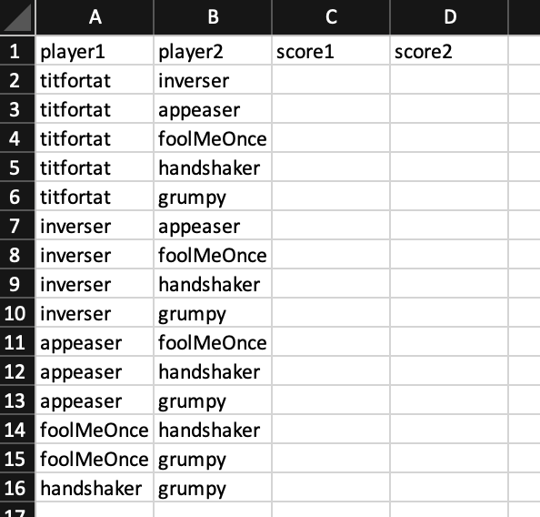
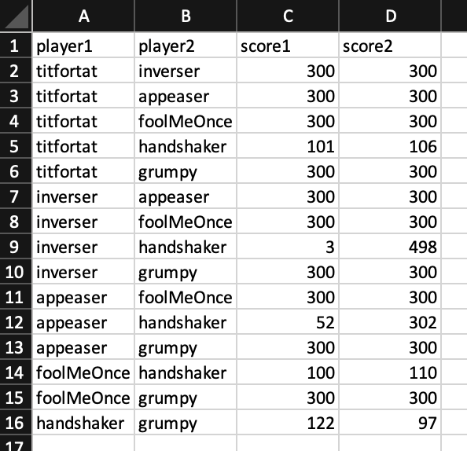
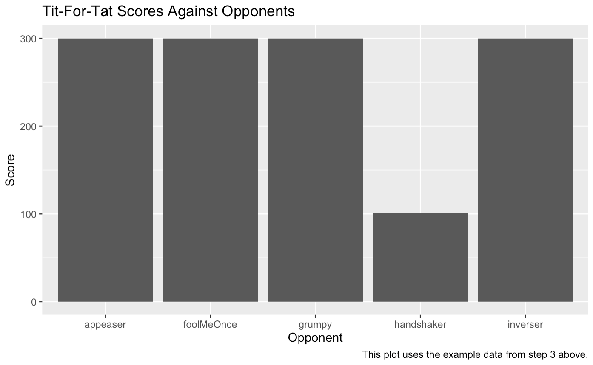

```{r setup, include=FALSE}

knitr::opts_chunk$set(echo = TRUE)

# check for required packages and install if not already
# list.of.packages <- c("tools", "roxygen2", "shiny", "dplyr", "ggvis", "progress")
# new.packages <- list.of.packages[!(list.of.packages %in% installed.packages()[, "Package"])]
# if (length(new.packages)) install.packages(new.packages)

# load libraries
library(tools) # needed for shiny app
library(readr) # read_csv()
library(dplyr) # dplyr()
library(ggplot2) # ggplot()

# source helper files for the prisoner's dilemma app
source("./axelRod-master/R/shiny_tournament.R")
source("./axelRod-master/R/fn.R")
source("./axelRod-master/R/Tournament.R")
source("./axelRod-master/R/Player.R")
source("./axelRod-master/R/zzz.R")

```

To begin this assignment, **make sure you have downloaded all the materials in this week's folder on Canvas**. Before you begin, make sure you have the files `data_assignment_sept16.Rmd` and `data_assignment_sept16.pdf` as well as the folders `axelRod-master` and `rmd_photos` in the same folder on your computer. You will be using a Shiny app, developed by [Simon Garnier](https://github.com/swarm-lab/axelRod/tree/master/R) and edited slightly by the TF team, that will only work if those things are all in the same place.

Next, **you must set your working directory to the source file location**. To do so, select 'Session' from the menu bar at the top of your screen, hover over 'Set Working Directory', then select 'To Source File Location'.

When knitting your RMarkdown file to a PDF, make sure to say "No" when it asks you if you would like to "Render and view this document using Shiny instead."

If you have trouble getting the Shiny app to work (or with anything else), please come to the teaching team. We are happy to help!

# The Evolution of Cooperation

Axelrod's \textit{Evolution of Cooperation} uses the construct of the Prisoner's Dilemma to illustrate how cooperation can emerge despite incentives not to. In the Prisoner's Dilemma game, players must choose whether to cooperate or defect. The payoffs for doing one or the other depend on what the other player does, but no matter if the other player cooperates or defects, it is always strictly better for players to defect. 

This can be seen in the table below, which replicates the game Axelrod uses throughout his book. If player 2 cooperates, it's better for player 1 to defect, since then player 1 would receive 5 points instead of 3. If player 2 defects, player 1 definitely wants to defect and receive 1 point rather than 0. So no matter what each player expects the other to do, they will both choose to defect, yielding 1 point to each player.

\begin{center}
\begin{tabular}{ | c | c | c | } 
\hline
P1 $\downarrow$; P2 $\rightarrow$ & C & D \\ 
\hline
C & R = 3, R = 3 & S = 0, T = 5 \\ 
\hline
D & T = 5, S = 0 & P = 1, P = 1 \\ 
\hline
\end{tabular}
\end{center}

But ideally, in the long run (in a repeated game) players would like to cooperate and receive 3 points on each round. Axelrod explains how strategies of cooperation can evolve even in circumstances where players are antagonists (like Allied and Axis soldiers in the trenches of World War I) or when the players are not capable of foresight (as is the case for cooperation in biological systems).

# The Prisoner's Dilemma Simulator

For this week's Data Exploration assignment, you will be working with a Shiny app that simulates prisoner's dilemma games. To use it, simply run the code chunk above labeled 'setup', then run the following code (`shiny_tournament()`). Doing so will open the app in a separate window.

P.S., the "Instructions" tab in the app is broken. Don't worry if it doesn't display anything for you. Refer to this document for instructions. 

P.P.S., when you close the app window, there may be some warnings or errors (like "no loop for break/next, jumping to top level"). You can just ignore them.

```{r, include = F, message = F}

shiny_tournament()

```

## Setup

Now we're going to do a round-robin style tournament between strategies of your choosing, similar to the ones Axelrod conducted. All students must complete this part, as the subsequent questions are based on the tournament you conduct here. 

**First**, choose at least 6 strategies from the menu that look interesting to you. Your task is to play each one against all the other opponents and record the results in the excel file available in the Google Drive called `prisoners_dilemma_data.xlsx`.

**Second**, once you have chosen your strategies, type all the pairwise combinations of those strategies into the columns `player1` and `player2`. Make sure you type the strategies exactly as they appear in the application, including the case of the letters! Your spreadsheet should look this like after you have done so (but with the strategies you choose):



Note that there are 15 ways to combine 6 elements into pairs\footnote{In math terms, this results from the fact that ${6 \choose 2} = 15$}, so if you don't have 15 pairs, check your work.  Also note that the more strategies you choose, the more typing you will have to do.

**Third**, set the app so that "Tournament Type" = "Repeated", "Number of Rounds" = 100, and "Number of Replications" = 100. Just as in Axelrod's simulation, we are playing repeated games (this is determined by the "Number of Rounds"). The "Number of Replications" changes how many times the computer plays each repeated game. So in the example above, the computer will repeat the 100-round game of titfortat vs. inverser 100 times over and take the average outcome of each of those replications. This is useful because some of the strategies rely on probability (e.g. play "Defect" with probability .5) and so the outcome will be different each time. We average over many outcomes to see which strategy wins on average. Once you're done, your spreadsheet should look something like this, but with different strategies:



Of course, don't just copy these numbers, since they're made up.

**Fourth**, save the file as a CSV. To do so, go to File > Save As, then set the File Format to be `CSV UTF-8 (Comma delimited) (.csv)`. Make sure to save it with the name `prisoners_dilemma_data.csv`.


Now you can finally read the data you created into R using the following code and start answering the questions that follow.
```{r}

pd_data <- read_csv("data/prisoners_dilemma_data.csv") %>% 
  mutate(winner = case_when( # if you are interested, case_when() is a very useful
    score1 > score2 ~ player1, # function to create new variables. check out how it
    score1 < score2 ~ player2, # works by googling.
    score1 == score2 ~ "tie"
  ))

```

## Question 1

**How do the strategies you chose rank against each other based on the number of wins? How do they rank based on the number of points won? Discuss the patterns you see here as they relate to what you read from Axelrod. Keep in mind the concepts of niceness, retaliation, forgiveness, and clarity.**

The following code makes a data frame called `player_data_long` that you can use to rank the strategies based on the number of points won during the tournament. As a hint, you may want to try using `group_by()`, `summarize()`, and `arrange()` on `player_data_long`.

If you want, try to figure out what each line of code does. Cleaning the data and rearranging it like this is an important part of data science, not just running regressions and taking means. This is why we are leaving some of it to you, via `group_by()` and `summarize()`.

```{r Question 1}

player1_data <- pd_data %>% select(player = player1, score = score1, opponent = player2)
player2_data <- pd_data %>% select(player = player2, score = score2, opponent = player1)
player_data_long <- bind_rows(player1_data, player2_data)

# Best strategy based on wins
# I do not count a tie as a win (all ties include titfortat)
pd_data %>% 
  count(winner) %>% 
  arrange(desc(n))

# Best strategy based on number of points
player_data_long %>% 
  group_by(player) %>% 
  summarize(min_score = min(score),
            med_score = median(score),
            avg_score = mean(score),
            max_score = max(score),
            total_score = sum(score),
            .groups = "drop") %>% 
  arrange(desc(avg_score))
```

To rank the strategies based on the number of wins, think about making use of the `winner` variable in the `pda_data` data frame.

## Question 2

**Make a plot like the one below that displays how your winning strategy (according to total points) fared against the strategies it played against. Using `player_data_long` is probably easiest, but complete this question however makes most sense to you. Comment on what you find.**



```{r Question 2}

player_data_long %>% 
  filter(player == "handshaker") %>% 
  ggplot(aes(x = opponent, y = score, label = score)) +
  geom_col(fill = "#00bfc4") +
  geom_text(size = 3, position = position_stack(vjust = 0.5)) +
  theme_light() +
  labs(title = "handshaker Scores Against Opponents",
       x = "Opponent",
       y = "Score")

```


## Question 3: Data Science Question

**Create a plot, similar to the one above, that displays how each strategy fared against all the other strategies. Which strategies were most successful against which other ones? Comment on the patterns that you see.**

```{r Question 3}

player_data_long %>% 
  ggplot(aes(x = opponent, y = score, label = score)) +
  geom_col(fill = "#00bfc4") +
  facet_wrap(~player, scales = "free") +
  geom_text(size = 3, position = position_stack(vjust = 0.5)) +
  theme_light() + 
  theme(axis.text.x = element_text(angle = 45, vjust = 0.5, hjust = 0.5)) +
  labs(title = "Scores Against Opponents for each strategy",
       x = "Opponent",
       y = "Score")

```


## Question 4

**What is the main difference between the game you played here and the tournament Axelrod implemented? How do you think this difference might matter?**
