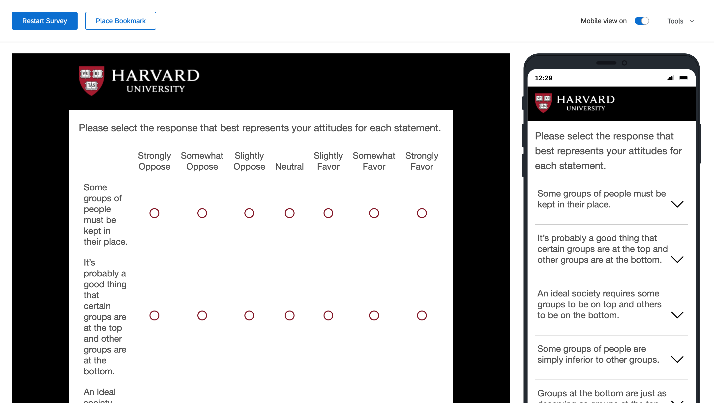
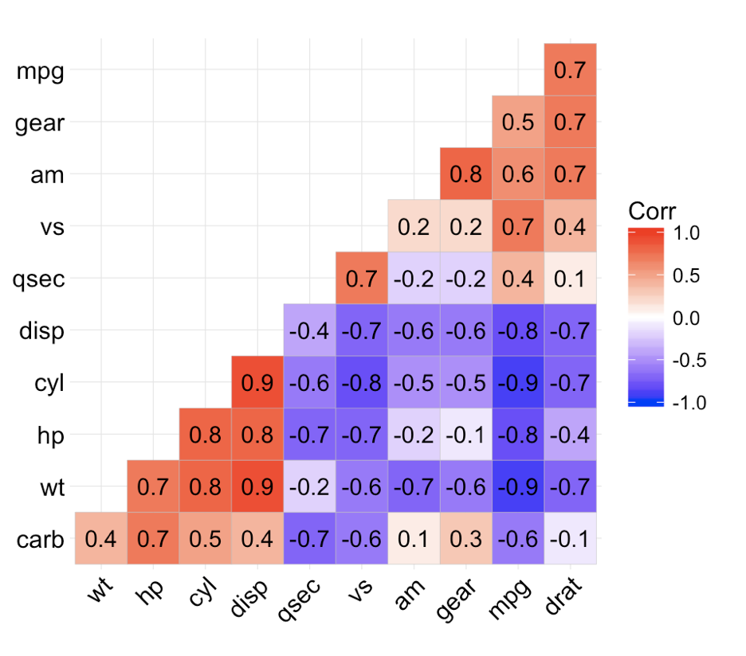

```{r setup, include=FALSE}
knitr::opts_chunk$set(echo = TRUE)
# library(dplyr) # filter(), group_by(), summarize
# library(readr) # read_csv()
# library(ggplot2) # ggplot()
library(tidyverse)
library(estimatr) # difference_in_means()
library(gt)
library(mice)
library(ggcorrplot)
library(stargazer)
library(tidymodels)
```

# Social Dominance and Politics

Welcome to the fourth Data Exploration Assignment. This week, we read about Social Dominance Theory, and its related psychological construct, Social Dominance Orientation (SDO). SDO is measured through a survey scale consisting of 16 items that we already explored in class. In this assignment, you will explore data on SDO and its relationship with other variables from a nationally representative survey fielded in 2018.

Note that the actionable part of each question is **bolded**. 

**Data Details:**

* File Name: \texttt{sdo\_data.csv}

* Source: These data are condensed and adapted from a [survey](https://wthh.dataforprogress.org/get-the-data) by Data for Progress in 2018 (N = 3144). The data are representative of 2018 voters.

Variable Name         | Variable Description
--------------------- | --------------------------------------
\texttt{sdo5}       | Five-point social dominance orientation (SDO) scale: 1. Minimum SDO; ...; 5. Maximum SDO
\texttt{female}         | Indicator for whether or not the respondent is female. Coded 1 if respondent is female, 0 otherwise.
\texttt{birthyr}         | Respondent's birth year
\texttt{educ}        | Education: 1. Didn't graduate HS; 2. HS graduate; 3. Some college; 4. 2-year college; 5. 4-year college; 6. Postgraduate degree
\texttt{race}  | Race: 1. White; 2. Black or African-American; 3. Hispanic or Latino; 4. Asian or Asian-American; 5. Native American; 6. Mixed Race; 7. Other; 8. Middle Eastern
\texttt{favor\_trump}    | Favorability of Donald Trump: 1. very unfavorable; ...; 4. very favorable
\texttt{favor\_blm}    | Favorability of Black Lives Matter: 1. very unfavorable; ...; 4. very favorable
\texttt{favor\_metoo}        | Favorability of the Me Too movement: 1. very unfavorable; ...; 4. very favorable
\texttt{american\_customs}       | "The growing number of newcomers from other countries threatens traditional American customs and values": 1. Strongly disagree; ...; 5. Strongly agree
\texttt{race\_ident}       | "How important is being [respondent's race] to you?": 1. Not at all important; ...; 4. Very important
\texttt{pid3}       | Three-category party identification: 1. Democrat; 2. Independent; 3. Republican
\texttt{ideo5}       | Five-category political ideology: 1. Very liberal; ...; 5. Very conservative
\texttt{fear\_of\_demographic\_change}       | Fear of demographic change in the US: 0. Least fearful; ...; 1. Most fearful
\texttt{confederate\_flag}       | Is the Confederate flag mostly a symbol of slavery and white supremacy or Southern heritage and culture? Coded either "slavery" or "heritage"
\texttt{presvote16}       | Vote choice in the 2016 presidential election

\newpage

## Question 1: REQUIRED

Before looking at data, the science of political psychology often involves building surveys. The teaching team builds the surveys you take using an online survey-building software called Qualtrics. This is often the same software that researchers use to build surveys and collect data that is eventually published in peer-reviewed journals. In this question, you'll create your own brief survey. 

**THIS QUESTION IS REQUIRED FOR ALL STUDENTS. Go to harvard.qualtrics.com and log in using your HarvardKey. Click "Create new project", then select "Survey". You can name your survey whatever you like. Leave the other two drop-down options at their default and click "Create project". Now you can input the SDO scale, which is given below. Make sure to include all 16 items, split into two sub-scales, in your survey. They are split into two sub-scales here, but they don't need to be in your survey. For each item, there should be seven response categories: Strongly favor, Somewhat favor, Slightly favor, Neutral, Slightly oppose, Somewhat oppose, Strongly oppose. Think about the format you think is best for these questions, available under "Question Type". How might the format of the questions affect the responses you get from the survey, or the experience respondents have while taking the survey?  Also consider question ordering and how that may also affect the responses. BE SURE TO UPLOAD A SCREENSHOT OF YOUR QUALTRICS SURVEY TO YOUR BLOG THIS WEEK.**

**Dominance Sub-Scale**
\begin{enumerate}
  \item Some groups of people must be kept in their place.
  \item It's probably a good thing that certain groups are at the top and other groups are at the bottom.
  \item An ideal society requires some groups to be on top and others to be on the bottom.
  \item Some groups of people are simply inferior to other groups.
  \item Groups at the bottom are just as deserving as groups at the top. 
  \item No one group should dominate in society.
  \item Groups at the bottom should not have to stay in their place.
  \item Group dominance is a poor principle.
\end{enumerate}

**Anti-Egalitarianism Sub-Scale**
\begin{enumerate}
  \item We should not push for group equality.
  \item We shouldn't try to guarantee that every group has the same quality of life.
  \item It is unjust to try to make groups equal.
  \item Group equality should not be our primary goal.
  \item We should work to give all groups an equal chance to succeed.
  \item We should do what we can to equalize conditions for different groups.
  \item No matter how much effort it takes, we ought to strive to ensure that all groups have the same chance in life.
  \item Group equality should be our ideal.
\end{enumerate}



I created the survey by splitting the two category of questions, Dominance and Anti-Egalitarianism, into two matrix tables. Thinking about how this might affect responses compared to other methods, users might change their answers after goign through the statements in each category because they can see all of them at the same time in the matrix table. If I had separated each statement into its own question, then respondents would not be able to go back and change their response. Given that there are not too many statements in this survey, I think that it would be appropriate to separate each statement into its own question. However, if there were more statements that were similar, then I might go back to using the matrix table for ease of coding and responding on the user end.

\newpage

## Question 2

Now let's take a look at the data.
```{r}

sdo <- read_csv("data/sdo_data.csv", col_types = cols(
  sdo5 = col_double(),
  female = col_double(),
  age = col_double(),
  educ = col_double(),
  race = col_double(),
  favor_trump = col_double(),
  favor_blm = col_double(),
  favor_metoo = col_double(),
  american_customs = col_double(),
  race_ident = col_double(),
  pid3 = col_double(),
  ideo5 = col_double(),
  fear_of_demographic_change = col_double(),
  confederate_flag = col_character(),
  presvote16 = col_character()
))

```

**What is the distribution of social dominance orientation in the sample? Make a plot, and report the mean and standard deviation of SDO in the sample. Extend this problem by splitting the plot by party ID of the respondent. Comment on what you find.**

```{r Question 2, warning=FALSE}
# Setting warning to FALSE to remove false positive errors

# Distribution of social dominance orientation
sdo %>% 
  mutate(mean_sdo = mean(sdo5)) %>% 
  ggplot(aes(x = sdo5)) +
  geom_histogram(stat = "count", fill = "#00bfc4") +
  geom_vline(aes(xintercept = mean_sdo), linetype = "dashed") + 
  theme_light() +
  labs(title = "Distribution of Social Dominance Orientation",
       x = "Social Dominance Orientation Score",
       y = "Number of Responses",
       caption = "Source: Data for Progress")

# Reporting mean and standard deviation of social dominance orientation
sdo %>% 
  summarize(mean = mean(sdo5),
            std = sd(sdo5)) %>% 
  gt() %>% 
  tab_header(title = "Summary Statistics of SDO") %>%
  cols_label(
    mean = "Mean",
    std = "Standard Deviation"
  )

# Distribution of social dominance orientation by party
# Recoding NA as Independent
sdo_party <- sdo %>% 
  mutate(pid3 = case_when(
    pid3 == 1 ~ "Democrat",
    pid3 == 3 ~ "Republican",
    TRUE ~ "Independent"
  )) %>% 
  group_by(pid3) %>% 
  mutate(mean_sdo = mean(sdo5)) %>% 
  ungroup() %>% 
  ggplot(aes(x = sdo5, label = mean_sdo)) +
  geom_histogram(stat = "count", fill = "#00bfc4") +
  geom_vline(aes(xintercept = mean_sdo), linetype = "dashed") + 
  facet_wrap(~pid3, ncol = 1, ) +
  theme_light() +
  labs(title = "Distribution of Social Dominance Orientation by Party",
       x = "Social Dominance Orientation Score",
       y = "Number of Responses",
       caption = "Source: Data for Progress")

sdo_party

# png("sdo_party.png", units="in", width=8, height=5, res=300)
# print(sdo_party)
# dev.off()
```

From this sample, we can see that the distribution of SDO is skewed right, where most respondents had a SDO score of 1 and it generally trailed off as SDO increased. The mean SDO score was about 2.05 with a standard deviation of about 0.92. However, when we break down the SDO Score distributions by party, we clearly see that Democrats have a much lower SDO score on average than Republicans (The means can be seen with the dotted line). On average, Democrats in the sample have a SDO Score of 1 point lower than Republicans with Independents being in between the two.

\newpage

## Question 3

In the reading for this week, we saw that gender is central to social dominance theory, which predicts that men tend to have higher SDO than women do. **Is this true in this sample as well? Report the average SDO for men and women. Comment on what you find. Extend this question by reporting the difference in means along with the p-value. Is the difference significant at a .05 significance level?**

```{r Question 3, warning=FALSE}
# Setting warning to FALSE to remove false positive errors

# Distribution of social dominance orientation by sex
# Recoding NA as Independent
sdo_female <- sdo %>% 
  mutate(female = case_when(
    female == 1 ~ "Female",
    female == 0 ~ "Male"
  )) %>% 
  group_by(female) %>% 
  mutate(mean_sdo = mean(sdo5)) %>% 
  ungroup() %>% 
  ggplot(aes(x = sdo5)) +
  geom_histogram(stat = "count", fill = "#00bfc4") +
  geom_vline(aes(xintercept = mean_sdo), linetype = "dashed") + 
  facet_wrap(~female, ncol = 1, ) +
  theme_light() +
  labs(title = "Distribution of Social Dominance Orientation by Sex",
       x = "Social Dominance Orientation Score",
       y = "Number of Responses",
       caption = "Source: Data for Progress")

sdo_female

# png("sdo_female.png", units="in", width=8, height=5, res=300)
# print(sdo_female)
# dev.off()

# Calculating difference in means
# Calculating the 95% confidence interval
difference_in_means(formula = sdo5 ~ female, data = sdo)
```

In our sample, Men do on average have a higher SDO Score than women at about 2.2 compared to 1.9. Through a difference in means test, we can confirm that this difference is statisically significant with a p-value of $3.55^{-14}$.

\newpage

## Question 4
**What is the correlation between `sdo5` and the `favor_trump` variable? Is the correlation statistically different from zero? You can use cor.test() for this question. Interpret what you find. If you want, extend this question by creating a scatterplot with the line of best fit to visualize the relationship.  You can use geom_point() in the ggplot architecture for this.**

```{r Question 4}
# Correlation plot
cor.test(sdo$sdo5, sdo$favor_trump)

# Scatterplot
sdo_trump <- sdo %>% 
  drop_na(favor_trump) %>% 
  ggplot(aes(x = favor_trump, y = sdo5)) +
  geom_jitter(width = 0.25, alpha = 0.3) +
  geom_smooth(formula = y ~ x, method = "lm") +
  theme_light() +
  labs(
    title = "Correlation between Social Dominance Orientation and Favorability of Donald Trump",
    x = "Favorability of Donald Trump",
    y = "Social Dominance Orientation",
    caption = "Source: Data for Progress")

sdo_trump

# png("sdo_trump.png", units="in", width=8, height=5, res=300)
# print(sdo_trump)
# dev.off()
```

The correlation between sdo5 and favor_trump is about 0.59 and it is statistically significant with a p-value of about $2.2^{-16}$. We can also see this trend on the scatter plot.

\newpage

## Question 5

Correlation matrices, like the one below, are useful for visualizing the pairwise relationships between several variables. They allow you to see the correlation coefficients of of many relationships at once. **Plot a correlation matrix of the correlation between SDO and some of the variables you think might be related to SDO and to each other. Choose at least 3 variables in addition to SDO. Before you make your plot, briefly discuss why you think the variables might all be related. The package `ggcorrplot` may be useful here. Discuss what you see in your plot.**

Here is an example of what your correlation plot might look like, using the `ggcorrplot` package:



```{r Question 5}
sdo %>% 
  select(sdo5, female, age, educ) %>% 
  cor() %>% 
  ggcorrplot(outline.col = "white", lab = TRUE) +
  labs(title = "Correlation Matrix")
```

The variables I chose to compared with sdo5 are: female, age, and educ I chose female first based on our reading because evidence suggested that men tend to have a higher SDO score on average compared to women. I chose age and educ as well for similar reasonings. I would expect that older respondents would have higher SDO scores because they tend to be more conservative and more highly educated respondents to have lower SDO scores because they tend to be more liberal and vote Democratic.

\newpage

## Question 6: Data Science Question

In this next question, we will use regression to model vote choice as a function of SDO and other variables of interest. This will help us get a fuller picture of the impact of social dominance orientation on political attitudes. We will fit the following model:

$$
\begin{aligned}
\text{rep\_vote} = \beta_0 + \beta_1\text{sdo5} + \beta_2\text{female} + \beta_3\text{white} + \beta_4\text{educ} +  \beta_5\text{age} + \beta_6\text{pid3} + \beta_7\text{ideo5} + \epsilon
\end{aligned}
$$

You'll notice that the variable `white` doesn't exist in our data set. When doing regression analysis, researchers often code race as a binary - for example, 1 for white and 0 for all non-white. This is done largely to make the regression results easier to interpret. Without turning race into a binary variable, the regression model would instead have several binary variables corresponding to each racial category (e.g. 1 for Black, 0 otherwise; 1 for Hispanic, 0 otherwise, etc.) which can quickly become unwieldy. Try it both ways if you are interested in seeing the difference (though you'll need to turn the `race` variable to a factor).

We also need to adjust the vote choice variable. Currently, `presvote16` codes vote choice for any party in the 2016 election (Dem, Rep, Green, Libertarian) as well as votes for others. This, too, would become unwieldy in a regression. To simplify, we will turn this into an indicator variable for whether or not the respondent voted for the Republican (Donald J. Trump), called `rep_vote`. To be clear, `rep_vote` should be 1 if the respondent voted for Trump, 0 if they voted for someone else, and NA if they did not vote.

**First, create the `white` variable from the `race` variable, as well as `rep_vote` from `presvote16`. Then, fit the linear model described above. Comment on what you see. Is this in line with what we would expect based on social dominance theory? Interpret your results and comment on what you find, especially as it relates to social dominance theory. Note that you can explore other model specifications in the next question.** 

```{r Question 6, results='asis'}
# Recoding variables
sdo_model_data <- sdo %>% 
  mutate(white = (race == 1),
         rep_vote = (presvote16 == "Trump"))

# Fitting the model
fit_1 <- lm(formula = rep_vote ~ sdo5 + female + white + educ + age + pid3 + ideo5, 
            data = sdo_model_data)

# Printing the model
stargazer(fit_1, header = FALSE, 
          dep.var.labels = c("Republican Vote"),
          covariate.labels = c("SDO", "Female", "White", "Education", 
                               "Age", "Party", "Ideology", "Intercept"),
          title = "Vote Choice as a Function of SDO and Other Variables of Interest")
```

There are some aspects of the model that I expect. For example, respondents who are white will on average have a higher probability of voting Republican by about 0.044, a one point increase in education level (higher is more educated) will result in a lower probability of voting Republican by about -0.011, and each increase in age for each respondent will on average increase their probability of voting Republican by about 0.002. However, what did surprise me was that Female respondents in this model were not statistically significant to vote less Republican. Thinking about about why this might be could suggest that the other variables are already accounting for most of the characteristics for voting Republican. I expect that many of these variables might confound with one another since they all have some overlap.

\newpage

## Question 7

**Lastly, just explore the data! This question is open-ended, but make sure you have a theoretical expectation in mind for any relationships between variables you want to explore, and include them in your answer.**

```{r Question 7, results='asis'}
# Start by using mice to impute the missing data
sdo_model_data_imputed <- sdo_model_data %>% 
  select(sdo5, female, white, educ, age, pid3, ideo5, rep_vote) %>% 
  mice(printFlag = FALSE) %>% 
  complete() %>% 
  as_tibble()

# Splitting the data
set.seed(1372)
splits <- initial_split(sdo_model_data_imputed)
sdo_train <- training(splits)
sdo_test <- testing(splits)

# Fitting another model
fit_2 <- lm(formula = rep_vote ~ sdo5 + female + white + educ + age + pid3 + ideo5, 
            data = sdo_train)

# Predicting on test data
pred_2 <- predict(fit_2, new_data = sdo_test)
mse_2 <- mean((sdo_test$sdo5 - pred_2)^2)

# Testing for data without imputed values

# Splitting the data
set.seed(1372)
splits <- initial_split(sdo_model_data)
sdo_train <- training(splits)
sdo_test <- testing(splits)

# Fitting the model
fit_1 <- lm(formula = rep_vote ~ sdo5 + female + white + educ + age + pid3 + ideo5, 
            data = sdo_train)

# Predicting on test data
pred_1 <- predict(fit_1, new_data = sdo_test)
mse_1 <- mean((sdo_test$sdo5 - pred_1)^2)

# Making a table of the mse
tibble(model = c("Model 1", "Model 2"),
       mse = round(c(mse_1, mse_2), 3)) %>% 
  gt()

# Printing both models
stargazer(fit_1, fit_2, header = FALSE,
          dep.var.labels = c("Republican Vote"), 
          column.labels = c("No Imputation", "With Imputated Data"),
          covariate.labels = c("SDO", "Female", "White", "Education", 
                               "Age", "Party", "Ideology", "Intercept"),
          title = "Vote Choice as a Function of SDO and Other Variables of Interest")
```

I wanted to explore how imputation of the missing values in this dataset could affect our model. Using the `mice` package, I imputed missing values in the dataset and re-created the same model. As shown in the table, there is only a minimal difference among the coefficients and a small difference in mse scores when testing both models after conducting a training and testing split of the data. So, overall there is no real difference made as there are not many missing values in this dataset to begin with.
