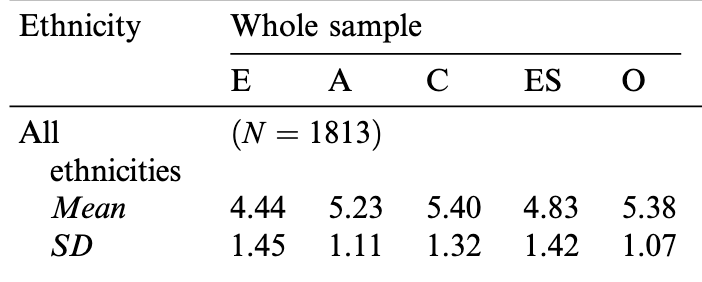

```{r setup, include=FALSE}
knitr::opts_chunk$set(echo = TRUE)
library(tidyverse)
library(gridExtra) # grid.arrange
library(psych) #fa.parallel
library(gt)
library(stargazer)
```

# Measuring Personality

Carney et al. (2009) use several strategies to assess personality in their investigation of the link between personality and political ideology. This week's assignment will help you understand aspects of these methodologies and associated challenges.

The survey you took included two different short versions of the Big Five Inventory. You will have the chance to compare these two inventories and to get some experience with the Personal Living Space Cue Inventory (PLSCI) ([Gosling et al. 2005](http://gosling.psy.utexas.edu/wp-content/uploads/2014/09/EnvandBehav05GoslingetalPLSCI.pdf)), which was also used in Carney et al. (2009). 

**Data Details:**

* File Name: \texttt{Oct7ClassData.csv}

* Source: These data are from the survey you took in class. You took the BFI-10, a short version of the Big Five Inventory ([Rammstedt and John 2007](https://psycnet.apa.org/record/2007-02371-015)) and the Ten-Item Personality Inventory (TIPI), which is a different instrument designed to quickly meausre the Big Five ([Gosling et al. 2003](http://gosling.psy.utexas.edu/wp-content/uploads/2014/09/JRP-03-tipi.pdf)). You then answered the same questions used by Carney et al. (2009) to assess political attitudes in some of their studies.

Variable Name         | Variable Description
--------------------- | --------------------------------------
\texttt{Overall}         | Self-reported overall ideology on a 1-5 scale with 1 being extremely liberal and 5 being extremely conservative
\texttt{Social}       | Self-reported social ideology on a 1-5 scale with 1 being extremely liberal and 5 being extremely conservative
\texttt{Economic}    | Self-reported economic ideology on a 1-5 scale with 1 being extremely liberal and 5 being extremely conservative
\texttt{Random ID}| A randomly generated respondent identifier
\texttt{BFI\_extraversion}        | The average of the two items on the BFI-10 associated with extraversion
\texttt{BFI\_agreeableness}    | The average of the two items on the BFI-10 associated with agreeableness
\texttt{BFI\_conscientiousness}| The average of the two items on the BFI-10 associated with conscientiousness
\texttt{BFI\_emot\_stability}| The average of the two items on the BFI-10 associated with emotional stability (also known as neuroticism, although low emotional stability is the same as high neuroticism)
\texttt{BFI\_openness} | The average of the two items on the BFI-10 associated with openness
\texttt{TIPI\_extraversion}| The average of the two items on the TIPI-10 associated with extraversion
\texttt{TIPI\_agreeableness}    | The average of the two items on the TIPI-10 associated with agreeableness
\texttt{TIPI\_conscientiousness}| The average of the two items on the TIPI-10 associated with conscientiousness
\texttt{TIPI\_emot\_stability}| The average of the two items on the TIPI-10 associated with emotional stability(also known as neuroticism)
\texttt{TIPI\_openness} | The average of the two items on the TIPI-10 associated with openness

The last 20 variables in the data are the actual items from the BFI-10 and the TIPI. If you want to refresh your memory about the questions and learn which questions were meant to go together, you can find more about the BFI-10 [here](https://www.ocf.berkeley.edu/~johnlab/bfi.htm) (scroll down to the "Is there a shorter version of the BFI available?" question) and the TIPI [here](http://gosling.psy.utexas.edu/scales-weve-developed/ten-item-personality-measure-tipi/ten-item-personality-inventory-tipi/).

Don't forget to load the data.

```{r faces, include=FALSE}
personality_data <- read_csv('data/Oct7ClassData.csv', col_types = cols(
  .default = col_double()
))
```

## Question 1
Check the Google Drive for your photo assignments and download the assigned photos of living space (you should be assigned to two photos). **Use the worksheet on the Google Drive to do an assessment based on the PLSCI. Based on the PLSCI and your own general impressions, fill out the new class survey with your guess about each person's openness, conscientiousness, and overall political ideology without looking at the actual data. Make sure to write down your responses to the survey since you won't have access to them after you submit. (Page 391 of [Gosling et al. 2002](http://gosling.psy.utexas.edu/wp-content/uploads/2014/09/JPSP02-Roomwithacue.pdf) might help you figure out which items on the inventory will be most helpful here.) Use the random ID to check your guesses. How did you do?** (If you are finding the PLSCI difficult and frustrating, peek ahead to the next few questions.)

```{r Question 1}
personality_data %>% 
  filter(`Random ID` == 91567) %>% 
  pivot_longer(c(Overall:Economic, BFI_extraversion:TIPI_10)) %>% 
  select(-`Random ID`) %>% 
  filter(str_detect(name, "BFI_openness|BFI_conscientiousness|Overall")) %>% 
  gt() %>% 
  tab_header(title = "Student 91567's Scores") %>%
  cols_label(
    name = "Item",
    value = "Score"
  )
```

My final rankings for student 91567 was a 2 for openness to experience and a 3 for conscientiousness on a 1-5 scale so I said that overall the student would be a moderate 3 overall on a 1-5 scale of liberalism-conservatism. Looking at the student's actual scores, I was spot on for openness but slightly too low on conscientiousness and not correct in guessing that they were a moderate. However, based on the research from Carney et al. (2009), my guess made sense. A person with a low openness score and a high conscientiousness score should be more likely to be more conservative. However, due to my prior knowledge that there were very few conservatives in the class, I labeled the respondent as a moderate.

\newpage

## Question 2
Each photo should have at least two people assigned to code it. Confer with each of the people who were also assigned to your photo and see what their ratings were on the PLSCI, as well as their guesses about openness, conscientiousness, and ideology. **What does this tell you about the PLSCI? Read a bit about intercoder (aka inter-rater) reliability and reflect on its importance in research like this.**

After conferring with the other people assigned to the same photo, we realized that a few of the questions were subjective and a few of the questions should have been thrown out. For example, our image was very blury and not too informative since the room was fairly empty. I had ranked the room as cheap because the room had been empty, however my classmate had ranked the room as expensive since it was still technically a Harvard dorm room (with expensive room costs). Another question had asked about the organization of CDs. Our photo had no CDs in it, so I scored a 4 in the middle for organization. My classmate had instead ranked the general organization of the room and put a lower score. This question should have been thrown out because it led to poor intercoder reliability. From these observations, I realized that intercoder reliability was extremely important in research like this because of the different subjective opinion of different people.

## Question 3
**What challenges did you encounter administering the PLSCI? What do you notice that might complicate applying this inventory today?**

As noted in Question 2, some of the questions regarding items such as CDs and magazines were outdated as most college students no longer have these items in their dorm rooms anymore. 

## Question 4
**How would you redesign the PLSCI to make it more useful/current?**

I would perhaps ask the respondents for their social media handles. For apps like Instagram, I think it would be interesting to see if the aesthetic of an individual's account affects their ideology. This would most likely be different for men and women as I expect men to have a lower aesthetic on average than women. I would also expect men who have a higher Instagram aesthetic to be more liberal since they are dedicating more time to organize their feed. 

\newpage

## Question 5
Let's see how the class compares to a large dataset of people who have taken one of these personality inventories. [Gosling et al. (2003)](https://citeseerx.ist.psu.edu/viewdoc/download?doi=10.1.1.113.6704&rep=rep1&type=pdf) report findings from administering the TIPI to about 1800 undergraduates. **Compare the class results to the published norms (look at the table on page 526, all ethnicities, Whole sample; i.e. the upper left corner of the table). Make a table or a plot of the class results and then write your thoughts about how these are similar or different to international norms and why that might be the case.**

```{r Question 5}
personality_data %>% 
  drop_na() %>% 
  select(`Random ID`, TIPI_extraversion:TIPI_openness) %>% 
  pivot_longer(TIPI_extraversion:TIPI_openness, 
               names_to = "question", 
               values_to = "response") %>% 
  mutate(type = case_when(
    str_detect(question, "TIPI_extraversion") ~ "E",
    str_detect(question, "TIPI_agreeableness") ~ "A",
    str_detect(question, "TIPI_conscientiousness") ~ "C",
    str_detect(question, "TIPI_emot_stability") ~ "ES",
    str_detect(question, "TIPI_openness") ~ "O",
  )) %>% 
  group_by(type) %>% 
  summarize(Mean = round(mean(response), digits = 2),
            SD = round(sd(response), digits = 2)) %>% 
  pivot_longer(Mean:SD, names_to = "measure") %>% 
  pivot_wider(names_from = type, values_from = value) %>% 
  select(measure, E, A, C, ES, O) %>% 
  gt() %>% 
  tab_header(title = "Harvard Sample TIPI Scores") %>%
  cols_label(
    measure = "Measure"
  )
```



Comparing the averages from our Harvard sample with the published results in Gosling et al. (2003), we can see that the TIPI scores are very similar across the board. Our sample had almost identical results in terms of conscientiousness and openness and a slightly higher score for extraversion, agreeableness, and emotional stability. However, the differences were all well below one standard deviation, so they could just be within the margin of error. When comparing these results to international norms, I might expect European countries to have similar results to these as they are the most identical to American norms. However, I would expect Asian countries with different norms as America to have different results.

\newpage

## Question 6
The BFI-10 and the TIPI are supposed to measure the same five personality traits. To what degree do they seem to be measuring the same constructs in our class sample? **Compare each BFI-10 index to its counterpart TIPI index. You can do this numerically by calculating the correlation coefficient, graphically with a plot, or both. Comment on what you find.**

```{r Question 6}
personality_data_corr <- personality_data %>% 
  drop_na() %>% 
  select(`Random ID`, BFI_extraversion:TIPI_openness) %>% 
  pivot_longer(BFI_extraversion:TIPI_openness, 
               names_to = "question", 
               values_to = "response") %>% 
  mutate(personality = case_when(
    str_detect(question, "extraversion") ~ "E",
    str_detect(question, "agreeableness") ~ "A",
    str_detect(question, "conscientiousness") ~ "C",
    str_detect(question, "emot_stability") ~ "ES",
    str_detect(question, "openness") ~ "O",
  ),
  type = case_when(
    str_detect(question, "BFI") ~ "BFI",
    str_detect(question, "TIPI") ~ "TIPI",
  )) %>% 
  select(-question) %>% 
  pivot_wider(names_from = type, values_from = response)

tipi_vs_bfi_plot <- personality_data_corr %>% 
  ggplot(aes(x = BFI, y = TIPI)) +
  geom_point(alpha = 0.2, color = "#00bfc4") +
  geom_smooth(method = "lm", formula = "y ~ x", se = FALSE, color = "#00bfc4") +
  facet_wrap(~personality) +
  theme_light() +
  labs(
    title = "TIPI vs BFI Scores in Harvard Sample"
  )

tipi_vs_bfi_plot

# png("tipi_vs_bfi_plot.png", units="in", width=8, height=5, res=300)
# print(tipi_vs_bfi_plot)
# dev.off()
```

From the correlation plot, we can see that TIPI and BFI both do have a positive correlation for each of the five personality traits. However, the two methods do not measure each trait in the same way. For example, we can see that for extraversion (E), the correlation between the two is extremely strong. However, the correlation between the two for Openness (O) is much weaker. This tells us that generally the two methods are both measuring the same constructs in our class sample, however the magnitude of the effects vary depending on the method used.

\newpage

## Question 7: Data Science Question
We are interested in whether personality is associated with political ideology. Multiple regression is one approach to simultaneously testing associations between several indepdendent variables and a single dependent variable of interest. **Pick one of the personality inventories and use all of the trait indices in a regression model with at least one of the political ideology questions as the dependent variable. Interpret the results. (Note that you can use OLS for this question, even though it might not be the most appropriate model. As a bonus, you can explain why OLS might not be the best model and suggest an alternative. As another bonus, take a look back at all of the regressions you have just run. Why might we be skeptical of any individual p-value associated with one of these regression coefficients?)** Non-data science students should consider tackling part of this question but only using bivariate regression (one political ideology dependnet variable and one personality independent variable.)

```{r Question 7, results='asis'}
personality_data_FBI_fit <- personality_data %>% 
  select(Overall, BFI10_1:BFI10_10)

personality_data_TIPI_fit <- personality_data %>% 
  select(Overall, TIPI_1:TIPI_10)

BFI_fit <- lm(formula = Overall ~ ., 
              data = personality_data_FBI_fit)

TIPI_fit <- lm(formula = Overall ~ ., 
              data = personality_data_TIPI_fit)

stargazer(BFI_fit, header = FALSE)
stargazer(TIPI_fit, header = FALSE)
```

From the BFI model output, we can see that this model is pretty bad. It has a very low R-squared value and there are no significant variables in the model. However, we know that OLS is probably not the best model for this question because political ideology is not distributed or affected on a linear scale. There also cannot be an ideology on our scale beyond a 1 and 5, so that's another point against using OLS. We also cannot fully trust the p-values of these variables because there are 2 question for each of the 5 personality traits. We can expect there to be some overlap between the two variables that's not being accounted for in this model.

On the other hand, the TIPI model has much better results than the BFI model. However, it should still run into similar issues as the BFI model given that the difference between them is just the questions being asked and the scale size. It would be interesting to see which TIPI questions performed well in this model and compare how if it was phrased differently or asked in the BFI method.

\newpage

## Question 8: Data Science Question
Is the Big Five really best characterized as five factors? If we ask ten questions on a personality inventory, we might think that these questions actually reflect only five underlying (or latent) variables. In fact, this is the supposition of the BFI-10 and the TIPI. Factor analysis is one way to examine data and investigate if the dimension of the data can be reduced from many variables to fewer underlying factors.  **Conduct a factor analysis on either the BFI-10 or the TIPI questions (note, these are the numbered variables, not the named variables) You may want to use the \texttt{fa.parallel} function from the \texttt{psych} package, which you can read more about [here](https://cran.r-project.org/web/packages/psychTools/vignettes/factor.pdf). How many factors does your analysis suggest best explain the class data? Optional bonus: run the code several times. Does your answer change? If so, why?**

```{r Question 8}
set.seed(1372)

factor_data <- personality_data %>% 
  select(BFI10_1:BFI10_10)

fa.parallel(factor_data)
```

Based on the scree plot after our parallel analysis, the results suggest that we should use 4 factors in our analysis. This number makes a bit of sense, since these 10 questions are actually only measuring 5 different personality traits. And looking at the graph, we can see that the analysis just barely misses recommending 5 factors with the simulated and resampled data just crossing over the actual data at 5 factors. After running the analysis a few times with different seeds, the number of factors stayed the same, but the number of components varied from 1 to 4. The number of components is determined by sharp breaks in the graph, so I expect this beind due to different questions being evaluated in the analysis with each run of the analysis. So, we might expect that some questions are very similar to others and that there could be an overlap between how these two questions measure personality. This makes a lot of sense because we know that personality is affected by a variety of different factors and are usually related to one another.

\newpage

## Question 9
If you still have your random ID, take a look at your own BFI-10 and TIPI index scores for each factor. **How do your scores compare to one another across instruments? How do your ratings on each of the Big Five factors compare to your own self image? (Remember that the BFI-10 uses a five point scale while the TIPI uses a seven point scale.)**

```{r Question 9}
my_score <- personality_data %>% 
  filter(`Random ID` == 43671) %>% 
  select(`Random ID`, TIPI_extraversion:TIPI_openness)

my_traits_plot <- personality_data %>% 
  drop_na() %>% 
  select(`Random ID`, TIPI_extraversion:TIPI_openness) %>% 
  pivot_longer(TIPI_extraversion:TIPI_openness, 
               names_to = "question", 
               values_to = "response") %>% 
  mutate(type = case_when(
    str_detect(question, "TIPI_extraversion") ~ "E",
    str_detect(question, "TIPI_agreeableness") ~ "A",
    str_detect(question, "TIPI_conscientiousness") ~ "C",
    str_detect(question, "TIPI_emot_stability") ~ "ES",
    str_detect(question, "TIPI_openness") ~ "O",
  ),
  # Pulling in values manually
  my_score = case_when(
    type == "E" ~ 3,
    type == "A" ~ 3,
    type == "C" ~ 6.5,
    type == "ES" ~ 7,
    type == "O" ~ 6,
  ),
  # Pulling in values manually
  avg_score = case_when(
    type == "E" ~ 4.72,
    type == "A" ~ 4.89,
    type == "C" ~ 5.43,
    type == "ES" ~ 4.52,
    type == "O" ~ 5.31,
  )) %>% 
  ggplot(aes(x = response)) +
  geom_histogram(stat = "count", fill = "#00bfc4") +
  geom_vline(aes(xintercept = my_score), linetype = "solid") + 
  geom_vline(aes(xintercept = avg_score), linetype = "dashed") + 
  facet_wrap(~type) +
  theme_light() +
  labs(
    title = "My Personal TIPI Scores (solid) Compared to Class Average (dotted)",
    x = "TIPI Scores",
    y = "Number of Responses"
  )

my_traits_plot

# png("my_traits_plot.png", units="in", width=8, height=5, res=300)
# print(my_traits_plot)
# dev.off()
```

Comparing my TIPI scores with the class average and distribution, I find that I had the most common scores on conscientiousness and openness, slightly lower scores for agreeableness and extraversion, and a higher score for emotional stability. I think these scores paint a pretty accurate representation of myself. When I showed the graph to my girlfriend, she also agreed that it was accurate. 
