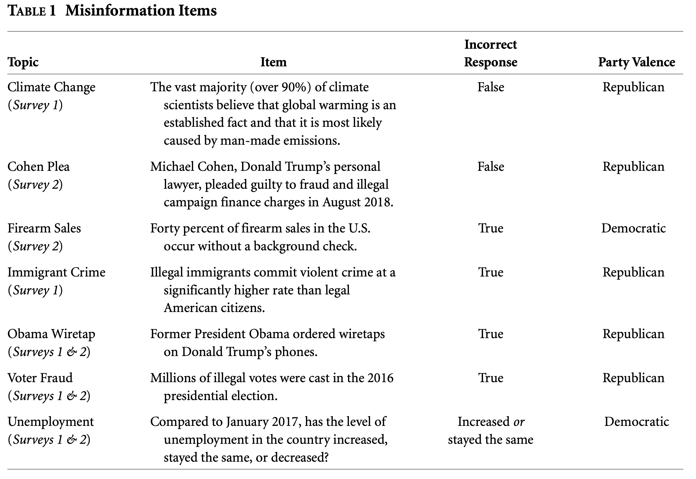
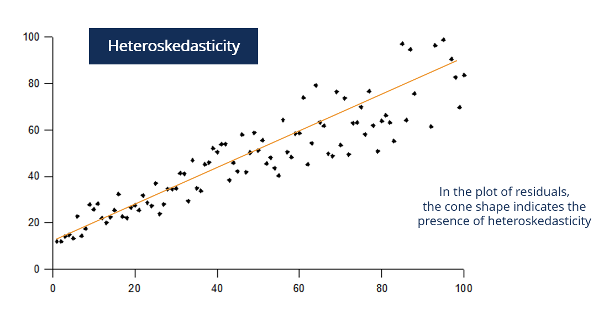

```{r setup, include=FALSE}
knitr::opts_chunk$set(echo = TRUE)
library(dplyr)
library(tidyr)
library(ggplot2)
library(lmtest)
library(sandwich)
library(estimatr)
library(stargazer)
```

This week we examined patterns of media consumption (Barbera et al. 2015) as well as the effects of media exposure on political atttidues (Iyengar and Kindar 1987; Moehler and Conroy-Krutz 2016; Asimovic 2021). In this Data Exploration Assignment, we will look more closely at patterns of media consumption as a way to gather information. In their 2020 paper "Partisan Gaps in Political Information and Information-Seeking Behavior: Motivated Reasoning or Cheerleading?", Peterson and Iyengar seek to understand whether partisan gaps in political knowledge (like, for example, on the established fact that humans drive climate change) are the result of genuine differences in beliefs or merely partisan cheerleading. 

On the one hand, we might think that, one way or another, partisans collect information that supports one viewpoint (e.g. that climate change isn't real or isn't cause by humans). What results is a genuine belief in an incorrect answer. However, partisans may also know the correct answer but give the incorrect answer that supports their party (i.e. partisan cheerleading).

In their experiment, the authors first randomly assign individuals to either receive an incentive for correct answers to factual questions (the treatmTent) or not (the control). Respondents were then asked a factual question about topics (seen below in able 1 from the paper) that were rife with misinformation at the time of the experiment (for example, whether Obama ordered wiretaps on Trump's phones, which he did not). But before they answered the questions, respondents could choose from five sources that would give them information about the topic. The sources included left-leaning (e.g., HuffPost, MSNBC), right-leaning (e.g., FOX, Breitbart), expert (e.g., Bureau of Labor Statistics), or mainstream (e.g., NYT, CNN) sources. Finally, respondents answered a true/false question (the particular questions are available in the paper). Note that the experiment was conducted on two surveys that differed slightly in the topics they used.

Below is Table 1 from the paper. Starting on the left, we have the topic and its associated political knowledge item, as well as the incorrect response to the item. In the last column is the party valence, which is the partisan direction in which an incorrect response to the item points. For example, believing that 40\% of firearm sales in the U.S. occur without a background check is an incorrect belief that is reinforced by group membership in the Democratic party.

```{r, echo=FALSE, out.width = "100%"}

```

For a subset of respondents, the authors also obtained online website browsing behavior. Some YouGov panelists have agreed to have their web activity tracked in return for YouGov points. From these data several variables are derived that quantify real-world web browsing behavior.

If you have a question about any part of this assignment, please ask! Note that the actionable part of each question is **bolded**.

# Media and the Partisan Information Divide

**Data Details:**

* File Names: \texttt{misinfo.combined.RData}; \texttt{news.choice.RData};  \texttt{combined.survey.demos.dea.RData}

* Source: These data are from Peterson and Iyengar (2020).

Variable Name         | Variable Description
--------------------- | --------------------------------------
In lieu of a variable description in the assignment itself, we have given you the codebook documents available in the replication data from the paper. You can find them in the files misinfo_combined_codebook.pdf, news_choice_codebook.pdf, and ncombined_survey_demos_codebook.pdf.

First, let's read in the data, which is in an .RData object. Using this file type to save R objects allows you to save all attributes of an object that may be lost if you save it to a .csv. You can also save more types of objects.

```{r}

load("misinfo.combined.RData")

# Removing NAs
na_ids <- misinfo.combined %>% 
  filter(is.na(correct.answer)) %>% 
  count(caseid) %>% 
  pull(caseid)

misinfo.combined <- tibble(misinfo.combined) %>% 
  filter(!caseid %in% na_ids)

```

\newpage

## Question 1
As usual, let's take a closer look at the data. 

# Part a
**What is the unit of observation in the `misinfo.combined` dataset? How is it different from the data we usually see from surveys?**

The unit of observation in this dataset would be `correct.answer` per `caseid` (person id), whether or not individuals get the correct answer for each information question.

# Part b
**Create a bar plot of the main outcome of interest, the number of questions that were correctly answered by respondents. You will need to do some manipulation of the data before you can make this plot. What does this distribution tell you about factual political knowledge in the electorate?**

```{r}
misinfo.combined %>% 
  group_by(caseid) %>% 
  summarize(n_correct = sum(correct.answer),
            .groups = "drop") %>% 
  ggplot(aes(x = n_correct)) +
  geom_bar() +
  theme_light()
```

This tells us that the political knowledge in the electorate is actually relatively high, with most people getting 4/5 questions correct. 

# Part c
**Split the bar plot you made in part b by treatment status - that is, by whether or not the respondent received an incentive for responding correctly. In addition, conduct a test of difference in means between the unincentivized and incentivized conditions. Did the incentives increase correct answers? If so, is it a meaningful increase?**

```{r}
misinfo.combined %>% 
  group_by(caseid, incentive) %>% 
  summarize(n_correct = sum(correct.answer),
            .groups = "drop") %>% 
  mutate(incentive = case_when(
    incentive == "0" ~ "control",
    incentive == "1" ~ "treatment",
  )) %>% 
  ggplot(aes(x = n_correct, fill = incentive)) +
  geom_bar(position = "dodge2") +
  theme_light()
```

We can see that giving an incentive led to a greater number of 4 and 5 correct questions among respondents than the control group which did not get an incentive. It could be significant, but more tests will be needed to determine this.

\newpage

# Question 2

## Part a

While the data we just loaded has most of the main variables, it is missing the demographics of the respondents. Demographic data are available in a different data set. To combine the two, we need to merge the datasets together. **Look at the different types of joining functions available from `dplyr`. You can see the four different types by running `?dplyr::join` from the console. You can also read more about these joins and see graphical summaries in the *R for Data Science* lesson (https://r4ds.had.co.nz/relational-data.html#outer-join) Choose which join you think is appropriate for this context and explain your reasoning. Once you have done that, try performing the merge using the function you chose.**

```{r}

load("combined.survey.demos.dea.RData")

full_data <- misinfo.combined %>% 
  left_join(combined.survey.demos, by = "caseid")

```

## Part b

When merging (or joining; the two are used interchangeably) two datasets, it's always important to check that your merge worked correctly. One way to do that is to check that the number of rows in the new dataset is correct.  **Check that the number of rows in the new dataset is equal to the number of rows in the `x` dataset. If the number of rows differs, go back and check your merge.**

```{r}
nrow(misinfo.combined)
nrow(full_data)
```


## Part c

**Now check the number of columns in the resulting dataframe after the merge. Explain why the new merged dataset has that number of columns.**

```{r}
ncol(misinfo.combined)
ncol(full_data)
```

The new merged dataset has more columns because we added in the demographics variables.

\newpage

# Question 3

Now that we've merged in the data, let's see if some people are better at answering these factual questions than others. Choose one or more demographic variables that you think might influence correctness on the misinformation items and formulate a hypothesis about how they will be related. You can also consider whether some people will answer some types of questions more accurately than others (e.g. economic vs. social/cultural issues). Perform whatever analyses you think are appropriate to investigate your hypothesized relationship.


```{r}
full_data %>% 
  group_by(caseid, college) %>% 
  summarize(n_correct = sum(correct.answer),
            .groups = "drop") %>% 
  mutate(college = case_when(
    college == "0" ~ "no college",
    college == "1" ~ "college",
  )) %>% 
  ggplot(aes(x = n_correct, fill = college)) +
  geom_bar(position = "dodge2") +
  theme_light()
```

\newpage

# Question 4

Now let's look at whether there is in fact a partisan divide in how partisans answer these factual questions. To do so, we'll look at the unincentivized condition.

## Part a

**Why were the authors of the study interested in the effect of incentives on partisan information divides? What are the two competing explanations of the partisan information divide that they are trying to distinguish between?**

The authors were interested to see if a monetary incentive might overcome partisan information divide. Republicans tend to build on more misleading misinformation from sources like Fox News. The results showed that it does not and suggest that people on both sides truly believe that they are each correct.

## Part b

**Among individuals who did not receive incentives for correct answers, report the proportion of Democrats and Republicans who answered each question correctly, as well as the absolute difference between the two. That is, for each question, report the proportion of Democrats who answered correctly alongside the proportion of Republicans who answered correctly, and the absolute value of the difference between them (which corresponds to the partisan divide).**

```{r}
full_data %>% 
  filter(incentive == 0) %>% 
  mutate(pid.binary = case_when(
    pid.binary == "0" ~ "Republican",
    pid.binary == "1" ~ "Democrat",
  )) %>% 
  drop_na(pid.binary) %>% 
  group_by(pid.binary) %>% 
  summarize(prop_correct = sum(correct.answer) / n(),
            .groups = "drop") %>% 
  pivot_wider(names_from = pid.binary, values_from = prop_correct) %>% 
  mutate(`Absoluate Difference` = abs(Democrat - Republican))
```

## Part c

Do partisans gravitate towards different types of sources of information? Here we'll see if respondents in the survey tend to choose sources that conform to their prior beliefs. **Find the proportion of respondents who chose copartisan, outpartisan, expert, and mainstream sources for each topic. Do some of the topics inspire different choices of source when looking for information?**

```{r}
full_data %>% 
  pivot_longer(copartisan.news.choice:mainstream.source, names_to = "source", values_to = "source_value") %>%
  filter(source_value != 0,
         incentive == 0) %>%
  mutate(pid.binary = case_when(
    pid.binary == "0" ~ "Republican",
    pid.binary == "1" ~ "Democrat",
  )) %>% 
  drop_na(pid.binary) %>% 
  group_by(pid.binary, source, topic) %>% 
  summarize(sum_source = sum(source_value),
            .groups = "drop") %>% 
  group_by(topic) %>% 
  mutate(total_topic = sum(sum_source),
         prop_source = sum_source / total_topic) %>% 
  ggplot(aes(x = source, y = prop_source, fill = topic)) +
  geom_col(position = "dodge2") +
  facet_wrap(~pid.binary) +
  coord_flip() +
  theme_light()
```

While the general trend remains similar across all topics for which source is most popular, some topics for Democrats such as climate change lead to a preference towards experts while voter fraud lead to mainstream source. For Republicans, firearm sales and Obama wiretap led to a preference towards copartisan news while Cohen's plea led to a preference towards mainstream source.

## Part d

Does strength of party ID matter for which sources respondents chose? **Find the proportion of strong vs. weak partisans who chose each type of source (copartisan, outpartisan, expert, mainstream), regardless of topic. What do you see? Is this what you would expect?**

```{r}
full_data %>% 
  pivot_longer(copartisan.news.choice:mainstream.source, names_to = "source", values_to = "source_value") %>%
  filter(source_value != 0,
         incentive == 0) %>%
  mutate(pid.binary = case_when(
    pid.binary == "0" ~ "Republican",
    pid.binary == "1" ~ "Democrat",
  )) %>% 
  drop_na(pid.strength) %>% 
  group_by(pid.binary, pid.strength, source) %>% 
  summarize(sum_source = sum(source_value),
            .groups = "drop") %>% 
  group_by(source) %>% 
  mutate(total_source = sum(sum_source),
         prop_source = sum_source / total_source) %>% 
  ggplot(aes(x = source, y = prop_source, fill = pid.strength)) +
  geom_col(position = "dodge2") +
  facet_wrap(~pid.binary) +
  coord_flip() +
  theme_light()
```

We can see that while there is not a major difference among all sources between strong and weak partisans, the strong Democrats much more prefer mainstream source than copartisan news source while strong Republicans much more prefer copartisan news source over all others.

\newpage

# Question 5

Now that we've looked at the partisan divide among those who didn't receive incentives, let's take a look at the effect of incentives on the partisan information gap. **Fit the following model twice; once among those who received incentives, and once among those who did not receive incentives. Describe and discuss what the results mean for the impact of incentives on the partisan information gap.**

$$
\begin{aligned}
\text{divide.coding} \sim \text{pid.binary}
\end{aligned}
$$

Be sure to take a close look at the way `divide.coding` is constructed and interpret your results carefully. **Data science students can extend this question by fitting the model with an interaction between `pid.binary` and `incentive` among all respondents.**

```{r, results='asis'}
fit_1 <- lm(divide.coding ~ pid.binary*incentive, data = full_data)

stargazer(fit_1)
```

In the codebook, we can see that a pid.binary of 0 means that the respondent is Republican and 1 mean that the respondent is Democratic. And an incentive of 1 means the respondent received an incentives and 0 means they did not. Based off this, we can learn from this model that a Republican who was given an incentive on average responded 0.075 more towards the the answer congenial for Democrats than a Republican who was not given an incentive on average while holding the party ID effect at a constant. On the other hand, a Democrat respondent who was given an incentive on average responded 0.029 more towards the the answer congenial for Republicans than a Democrat who was not given an incentive on average while holding the party ID effect at a constant. This conflicting evidence further supports the authors' claim that incentives do not make respondents more likely to find the real truth. In fact, they tend to have minimal effect and only slightly respond in the other direction than expected of them on average.

\newpage

# Question 6: Data Science Question

In the paper, the authors use what are called "robust standard errors" in their regression analyses. Robust to what? you might wonder. Before we get to that, recall that one of the key assumptions of ordinary least squres (OLS) regression is that the variance of the residuals is constant across values of the predictor(s). When this assumption is violated, the variance of the OLS estimator becomes biased, along with the standard errors on the coefficients. This in turn makes inferences based on those standard errors (e.g. p-values and confidence intervals) questionable.

In statistics jargon, non-constant variance of the residuals is called "heteroskedasticity." The image below shows the relationship between two variables `x` and `y`. In this case, the residuals are heteroskedastic because the distance between the black regression line and the data points is smaller at lower values of `x` and larger at higher values of `x`. Therefore, the assumption of constant variance of the residuals (homoskedasticity) does not hold. 

```{r, echo=FALSE, out.width = "100%"}

```

If the assumption of constant variance of the residuals holds, that means the variance of the residuals is indeed constant, which is referred to as "homoskedasticity." Pay attention to the prefixes hetero- (different) and homo- (same). When the residuals are heteroskedastic, we need to adjust our regression model to account for it. We do this with heteroskedasticity-robust standard errors! You'll sometimes see these called heteroskedasticity-consistent (HC) standard errors as well.

## Part a

Before we make an adjustment, let's first check to see if the residuals of the model we fit in the last question are indeed heteroskedastic. To do so, you can use the Breusch-Pagan (BP) test (accomplished in R with the `bptest()` from the `lmtest` package). The BP test is a hypothesis test where the null hypothesis is that the residuals are homoskedastic and the alternative hypothesis is that they are heteroskedastic. If you obtain a p-value from this test that is less than .05, you can reject the null hypothesis and conclude that the residuals are heteroskedastic. 

**Condust a Breusch-Pagan test on the model you fit in the last question that included all respondents. Are the residuals of this model heteroskedastic?**

```{r}
bptest(fit_1)
```

The p-value is less than 0.05, so we can conclude that the residuals are heteroskedastic.

## Part b

**Based on your conclusion in part a, implement the correct standard errors for your model. If you find that the residuals are heteroskedastic, use the function `coeftest(your_lm_here, vcov. = vcovHC(your_lm_here, type = 'HC1'))`, using your linear model object. Compare the news standard errors you find in this question to the ones you found in the previous question. How are they different?**

```{r, results='asis'}
stargazer(fit_1, coeftest(fit_1, vcov. = vcovHC(fit_1, type = 'HC1')), header = FALSE)
```

Comparing the two models, the one with robust standard errors (right) have ever so slightly greater standard errors than the original model (left). However, there is not a huge difference between the two.

\newpage

# Question 7

# Part a

In this paper, the authors compared information-gathering behavior in their survey to real-world information gathering. Some of their respondents agreed to have their browsing activity tracked, allowing the authors to observe which news websites the respondents visited. They then created average "alignment scores" for each respondent based on the alignment scores for the websites they visited. These alignment scores are essentially measures of the partisan leaning of news websites, where alignment scores close to -1 are left-leaning and alignment scores close to 1 are right-leaning. **Visualize the distribution of alignment scores. What does the distribution look like? Is it skewed? Multi-modal? What does this say about how people get their online news?**

First we need to load the news choice data:
```{r}

load("news.choice.RData")

```

## Part b

**Look in the replication files in the Google Drive. These are the actual replication files prepared by the authors. Look through those files and use them to recreate table 6 of the paper. Discuss what you find.**

# Question 8

Take a look at the other variables available in the data. Explore any further relationships between the variables that you're interested in.
